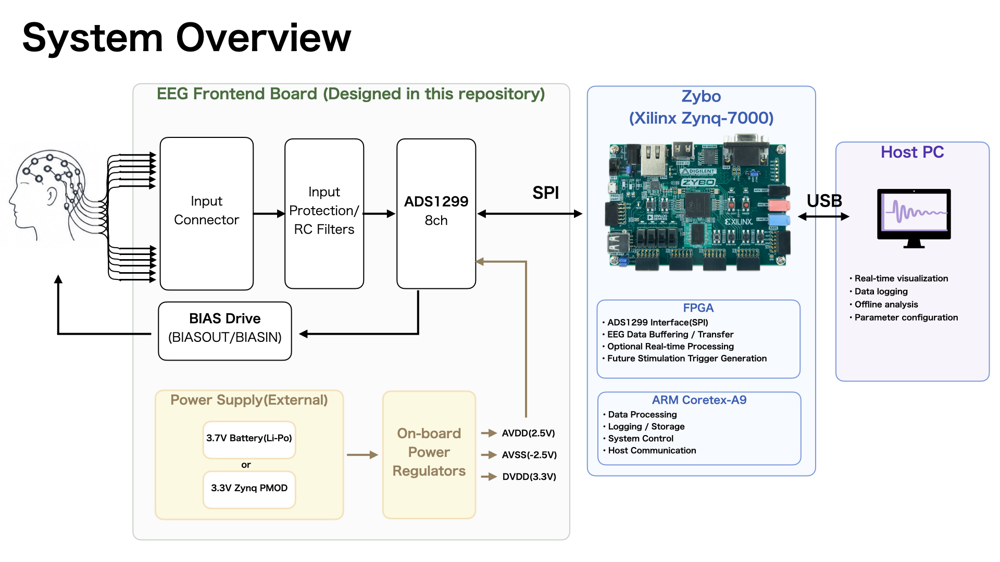
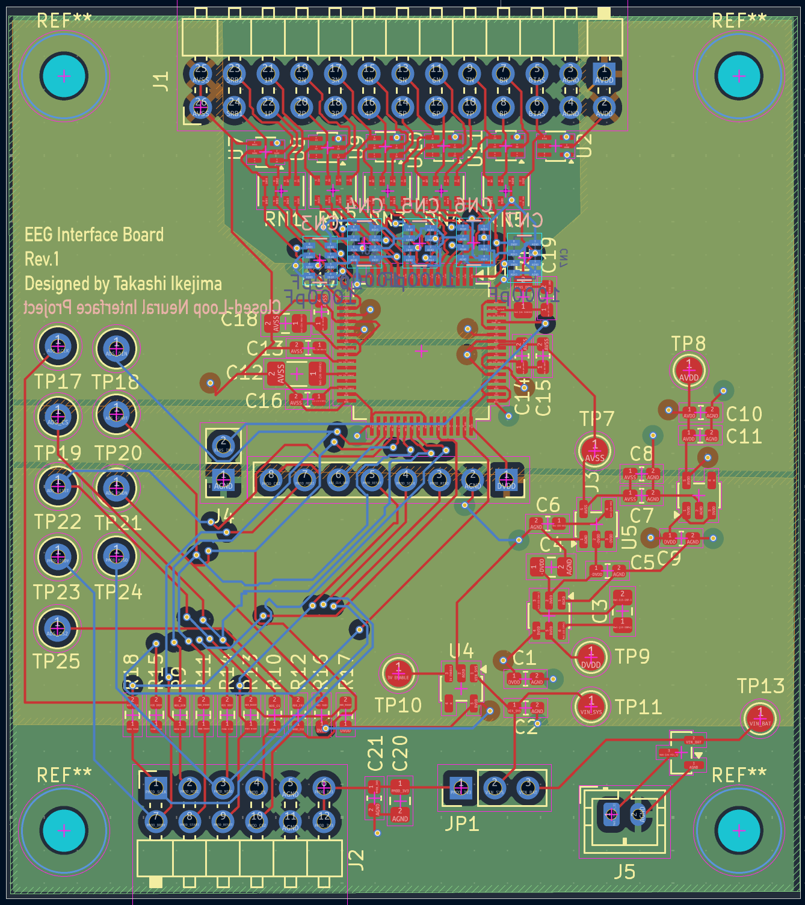
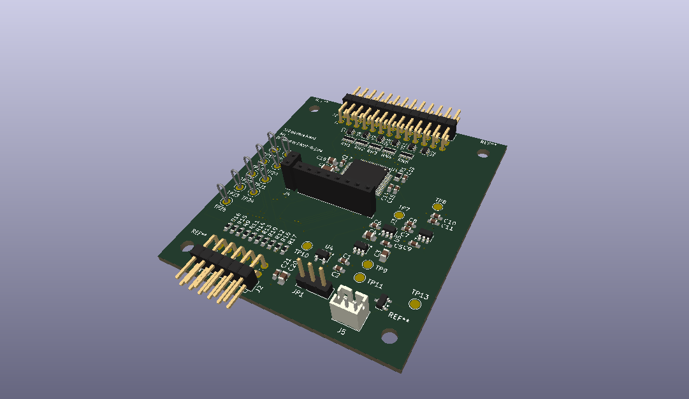

# EEG Platform

A custom EEG acquisition platform for real-time neural signal measurement and future closed-loop neurostimulation research.

The system is built around a custom ADS1299-based EEG frontend and a Zynq-based processing platform.  
The current focus is reliable multichannel EEG acquisition, real-time data transfer, and system-level validation from analog input to digital processing.

---

## System Overview



The platform consists of:

- **Custom EEG Frontend Board**
  - ADS1299-based multichannel EEG acquisition
  - Input protection
  - On-board power regulation
  - BIAS / common-mode feedback
  - SPI interface to the processing platform

- **Zybo Z7 / Zynq Platform**
  - ADS1299 SPI interface
  - EEG data reception and transfer
  - Optional real-time processing
  - Future stimulation trigger generation

- **Host PC**
  - Visualization
  - Data logging
  - Offline analysis
  - System configuration

The long-term goal is to extend this platform toward a closed-loop architecture in which brain-state information is estimated in real time and used to control non-invasive stimulation.

---

## Custom EEG Frontend

The EEG frontend board is designed specifically for this project.



It is based on the **ADS1299**, an 8-channel, 24-bit analog front end for biopotential measurement.  
The board integrates EEG input protection, analog acquisition, power regulation, and the digital interface required for connection to the Zynq platform.

The KiCad schematic and PCB design files are available in:

```text
hardware/kicad/eeg-frontend/
```

### 3D View



---

## Project Direction

The project is being developed in stages:

1. **EEG frontend design and fabrication**
2. **Multichannel EEG acquisition**
3. **Zynq-based real-time data handling**
4. **Signal processing and brain-state estimation**
5. **Future closed-loop stimulation integration**

The initial objective is not to build a complete clinical neurostimulation device, but to establish a reliable hardware and software platform for real-time EEG-based neural interface research.

---

## Repository Structure

```text
eeg-platform/
├── docs/
│   └── images/
│       ├── eeg-frontend-3d.png
│       ├── eeg-frontend-pcb.png
│       └── system_overview.png
│
├── hardware/
│   └── kicad/
│       ├── eeg-frontend/
│       └── reference_design/
│
└── README.md
```
